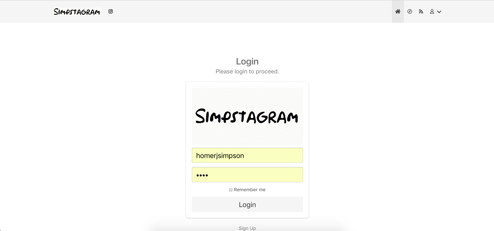
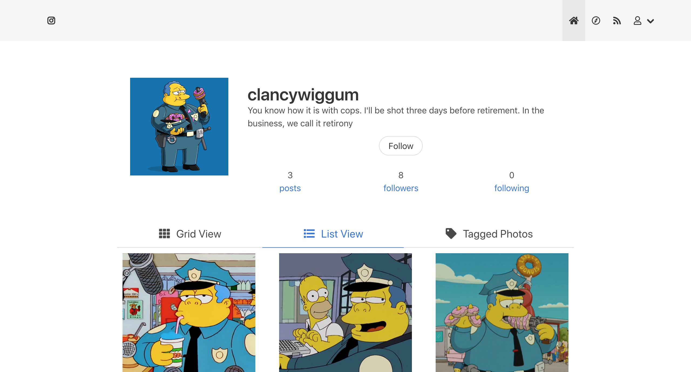
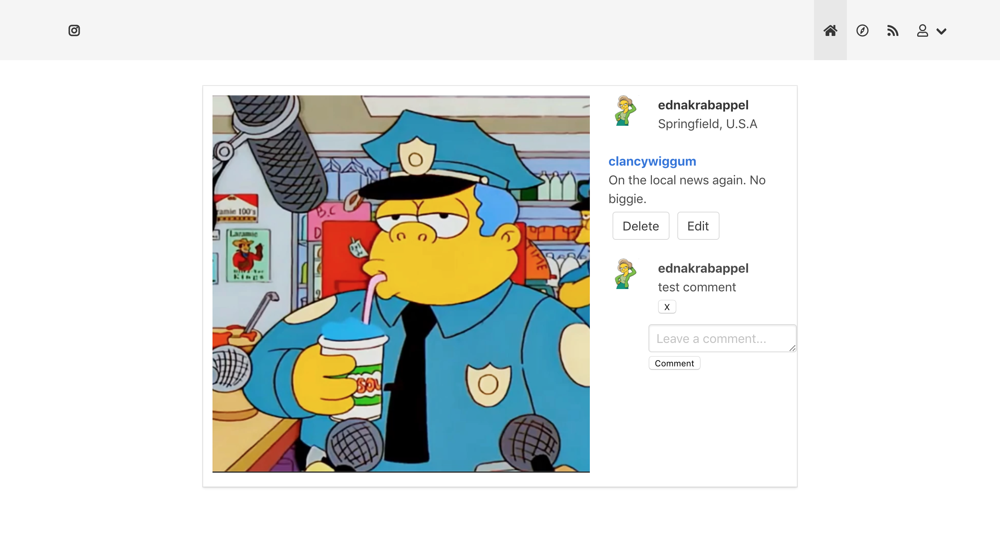
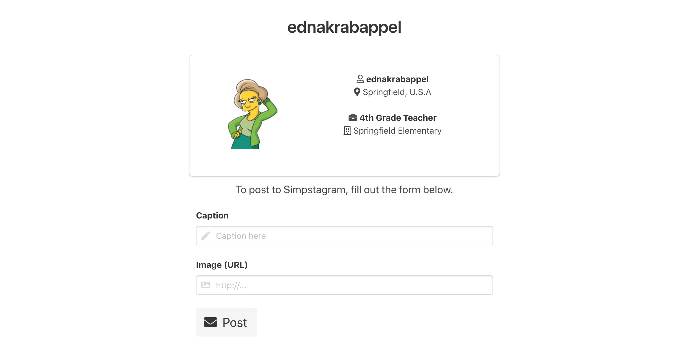

# wdi-project-two


## Technologies Used
* HTML5
* CSS
* JavaScript
* EJS
* [Google Fonts](fonts.google.com)

## Brief
To create a fully RESTful web application with similar aesthetic and functionality to Instagram.

<strong>MVP Requirements:</strong>

Web app must:
* Have at least 2 models – one of which is a user
* User authentication
* Include relationships - embedded or referenced
* Allow users to create, edit and delete posts and comments
* Is styled using the Bulma framework
* Be deployed online and accessible to the public
* Include wireframes


# Approach

## Screenshots

The Web App.
1. <strong>Log In/Sign Up</strong><br> A simple form prompting the user to either create an account or log in using stored credentials.


1. <strong>Home</strong><br> A screen that retrieves and displays data from the user model of the logged in user.<br>


1. <strong>Profile</strong><br> A profile page that retrieves and displays data from the user model and shows all of their posts. We can click on the 'follow' button follow the user connected to the profile page. We can also see a list of who this profile is followed by and who they are following by clicking on the 'followers' and 'following' links. We can click on the posts to go to the show page<br>


1. <strong>Post Show</strong><br> Displays image posted in the centre of the screen. A comments section is available on the right-hand side of the post, listing the caption and the original poster, a thumbnail of the logged-in user, and a user thumbnail above each comment, indicating who it belongs to. The poster can edit or delete their post. The commenter can edit or delete their comments.<br>


1. <strong>Post Form</strong><br> Simple form allowing the user to post an image with a caption to the web app.<br>



## Following

The "follow" functionalities are built on virtual fields in the User model:
```JavaScript
userSchema.virtual('numberOfFollowing')
  .get(function() {
    return this.profilesFollowing.length;
  });

userSchema.virtual('followers', {
  ref: 'User',
  localField: '_id',
  foreignField: 'profilesFollowing'
});

userSchema.set('toJSON', {
  virtuals: true
});
  ```
Each time the user clicks follow, the target user is added to the `profilesFollowing` field, and the user is added the `followers` field of the target user.

```JavaScript
<div class="column is-12-desktop has-text-centered">
  <% if(locals.isLoggedIn) { %>
    <% if(locals.currentUser.username !== user.username && !user.profilesFollowing.filter(id => id.toString() === locals.currentUser._id.toString()).length) { %>
      <form style="display: inline-block" action='/user/<%= user._id %>/follow/<%= locals.currentUser._id %>' method='POST'>
        <button class="button is-rounded">Follow</button>
      </form>
      <% } %>
      <% } %>
</div>
  ```


# Future Revision

* Allow users to upload images with Filestack.

* Let users 'like' photos.

* Organise explore section relative to how many friends you have in common. ie, someone who follows 10 people that you do will appear above someone who only follows 5.
